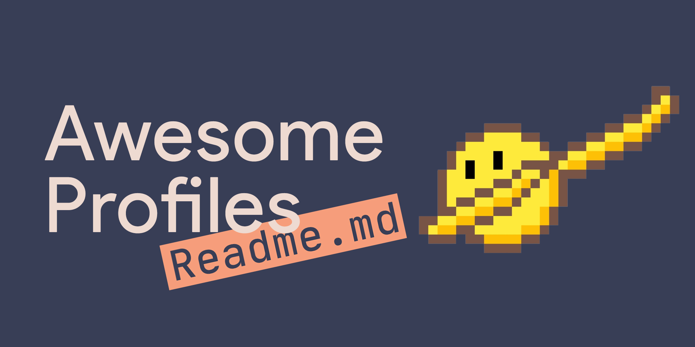

<p width="100%" align="center">
    
</p>

# Documentação README

<p id="Descricao" align="justify">
Este repositorio apresenta um README padronizado. Voce ira ver utilização de imagens com html e markdown.

Iremos apresentar menu como tabela de conteúdo, tecnologias, badges entre outros.
</p>

[](https://github.com)  [](https://github.com/)  [](https://git-scm.com)

## Tabela de conteudo

<ul>
    <li><a href="#Descricao">Descrição</a></li>
    <li><a href="#status">Status</a></li>
    <li><a href="Features">features</a></li>
    <li><a href="#mapa">Mapa do projeto</a></li>
</ul>

## :rocket: Status do projeto
<p id="status">
    ...Em Construção

</p> 

<p id="Features"></p>

## Features
- [X] Badges
- [X] Status
- [ ] tecnologias

<p id="mapa"></p>

## Mapa do projeto

```.
├───image
└───temp
```

## Finish him

<p width="100%" align="center">
    
</p>